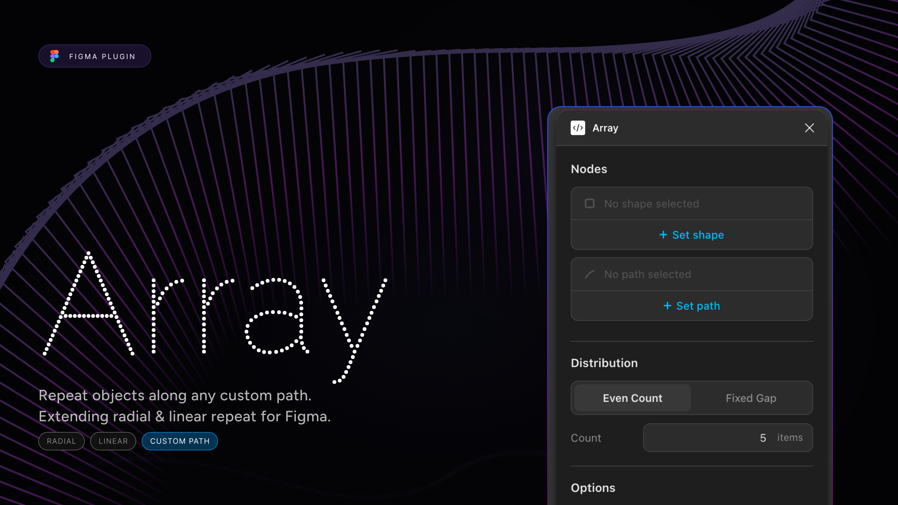

# Array for Figma

**Array** is a precision design tool that allows you to distribute objects along any vector path with perfect accuracy. Whether you're creating complex UI patterns, organic decorative elements, or technical diagrams, Array handles the math so you can focus on the design.

## Features

- **Precision Distribution**: Uses a custom Bezier Engine with Arc-Length Look-Up Tables (LUT) to ensure items are spaced perfectly along the physical length of a curve, avoiding the "bunching" common in simpler tools.
- **Two Distribution Modes**:
  - **Even Count**: Distribute a specific number of items evenly from start to finish.
  - **Fixed Gap**: Place items at precise pixel intervals (e.g., every 40px).
- **Smart Alignment**: Toggle "Rotate to path" to automatically align each object to the tangent of the curve at its position.
- **Native Experience**: A sleek, dark-themed interface that feels like a natural extension of Figma.

## How to Use

1. **Select your Object**: Choose the component, frame, or shape you want to repeat.
2. **Select your Path**: Select the vector path (line or curve) you want the objects to follow.
3. **Open Array**: Run the plugin from the Resources menu or search.
4. **Configure & Generate**:
   - Choose **Count** or **Gap** mode.
   - Set your desired value.
   - Toggle **Rotate to path** if needed.
   - Click **Generate Array**.

## Why Array?

Most path-distribution tools use "parametric" math, which causes objects to crowd together on tight turns and spread out on straightaways. Array calculates the actual physical distance along the path, ensuring a mathematically perfect distribution every time.

---

## Technical Details

Built with TypeScript and a custom-engineered Bezier evaluation engine. No heavy frameworks, just high-performance vector math.

Created by [Nischal Subedi](https://github.com/nischalmudennavar).
